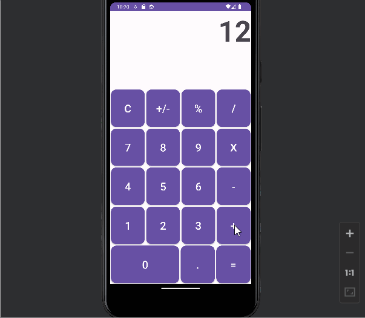

# Project 2 - Calculator w/ horizontal capabilities

This project is an extension of project 1 (android calculator) with capabilities that allow for horizontal use (sin,cos,tan buttons, saving of variables between switches of the orientation).

## Functionality 

The following **required** functionality is completed:

* [ ] User sees 16 buttons sized dynamically to fit all Android screen resolutions along with a TextView displaying the output.
* [ ] Upon changing the orientation of the device to landscape, you can see 5 additional buttons/operators (sin, cos, tan, Log 10, ln)
* [ ] Whenever the orientation is changed, the app saves your inputs so no data is lost.
* [ ] All buttons clicked are logged in the console using LogCat
* [ ] User can also press operators like +, -, *, / to add, subtract, multiply, divide integers and floats alike (i.e. 6, 3.15, etc.)
* [ ] There is also operators such as +/- which makes the number positive/negative as well as % which divides the number by 100.
* [ ] Lastly, there is a clear button so the user can restart/change their calculations at any time.
* [ ] The app also has a calculator icon.

The following **extensions** are implemented:

* View Finding 
* String Resources
* OnClickListener
* Bundle (Variable saving)
* LogCat

## Video Walkthrough

Here's a walkthrough of the calculator:

GIF created with [LiceCap](http://www.cockos.com/licecap/).

## Notes

When I was trying to add the horizontal buttons (sin, cos, tan, etc.) I wasn't sure how to add click listeners since the calculator is not always going to be in horizontal orientation. I figured out that you can check the orientation onCreate which, if it is indeed horizontal, I could then setup the click listeners for the respective buttons.

It was easy to figure out how to utilize bundle to save my variables whenever the orientation is changed so the user wouldn't lose their calculation(s).

## License

    Copyright [2023] [Tip Browne, Ethan Deporter]

    Licensed under the Apache License, Version 2.0 (the "License");
    you may not use this file except in compliance with the License.
    You may obtain a copy of the License at

        http://www.apache.org/licenses/LICENSE-2.0

    Unless required by applicable law or agreed to in writing, software
    distributed under the License is distributed on an "AS IS" BASIS,
    WITHOUT WARRANTIES OR CONDITIONS OF ANY KIND, either express or implied.
    See the License for the specific language governing permissions and
    limitations under the License.
